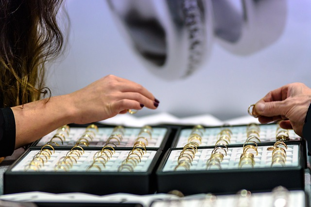

# fish-portfolio

## Technololgy Used

-[HTML](https://www.w3schools.com/html/html_elements.asp)
-[CSS](https://www.w3schools.com/css/default.asp)


## Description

I have created a portfolio for myself to showcase the projects I have completed as well as contact information.  This will be used to send out to employers for possible job opportunities.  

## Components:

-Navigation bar will bring you to specific projects completed as well as my contact information.
-There are 5 projects shown and if you click on the link (at some point) you will reach the project in it's entirety.  
-A brief description about myslef as well as a photo
-Contact information is in the footer containing links to email, Linkedin, Github and phone number.

## Example coding

-this HTML represents the images/boxes of previous projects. 


```<!-- all 4 boxes of projects -->
        <div class="all-box"> 
            <div class="box" id="Monster">
                <h1 class="title">Monster Capture</h1>
                
            </div>
            <div class="box" id="board">
                <h1 class="title">Swap or Sell</h1>
                
            </div>
            <div class="box" id="star">
                <h1 class="title">Star Jewelers</h1>
                
            </div>
            <div class="box" id="pool">
                <h1 class="title">Sports Pool</h1>
                
            </div>
        </div>```


## Learning Points

I need to go back and fix the media settings as I struggled way too long on those and am missing something.  The understanding of flexbox are coming along but more time is needed of course to feel comfortable with them.  

Visit the live site here: https://lauriefish22.github.io/fish-portfolio/
Github: https://github.com/lauriefish22/fish-portfolio
